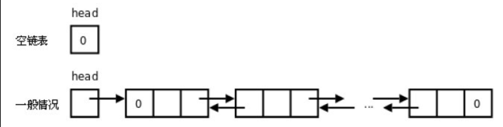
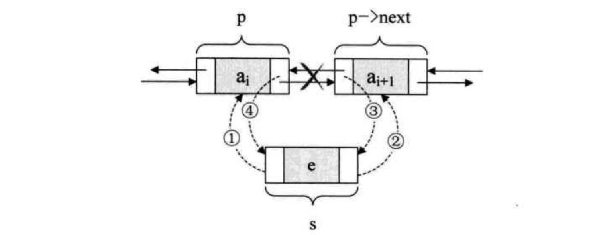
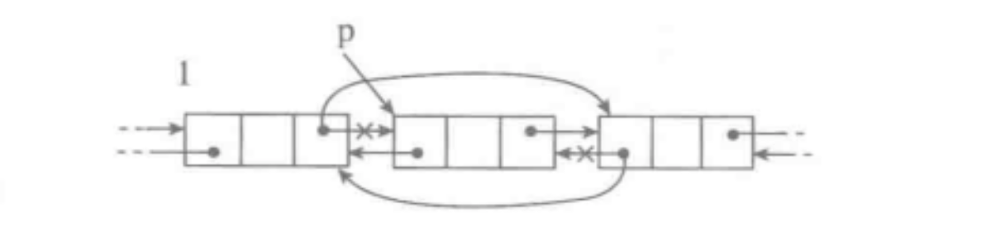

# 双向链表

一种更复杂的链表是“双向链表”或“双面链表”。每个节点有两个链接：一个指向前一个节点，当此节点为第一个节点时，指向空值；而另一个指向下一个节点，当此节点为最后一个节点时，指向空值。



## 操作

- is_empty() 链表是否为空
- length() 链表长度
- travel() 遍历链表
- add(item) 链表头部添加
- append(item) 链表尾部添加
- insert(pos, item) 指定位置添加
- remove(item) 删除节点
- search(item) 查找节点是否存在

## 实现

```python
class Node(object):
    # 节点
    def __init__(self,item):
        self.elem = item
        self.prev = None
        self.next = None

class DoubleLinkList(object):
    # 双向链表
    def __init__(self, node=None):
        self._head = node

    def is_empty(self):
        # 链表是否为空
        return self._head == None

    def length(self):
        # 链表长度
        # cur游标,用来移动遍历节点
        cur = self._head
        # count记录数据
        count = 0
        while cur != None:
            count += 1
            cur = cur.next
        return count

    def travel(self):
        # 遍历整个链表
        cur = self._head
        while cur != None:
            print(cur.elem,end=" ")
            if cur.next != None:
                print('-> ',end='') 
            cur = cur.next
        print('')

    def add(self, item):
        # 链表头部添加元素,头插法
        node = Node(item)
        node.next = self._head
        self._head = node
        # 判断是不是只有一个节点
        if node.next:
            node.next.prev = node

    def append(self, item):
        # 链表尾部添加元素,尾差法
        node = Node(item)
        if self.is_empty():
            self._head = node
        else:
            cur = self._head
            while cur.next != None:
                cur = cur.next
            cur.next = node
            node.prev = cur
            
    def search(self, item):
        # 查找节点是否存在
        cur = self._head
        while cur != None:
            if cur.elem == item:
                return True
            else:
                cur = cur.next
        return False
```

**指定位置插入节点**



```python
def insert(self, pos, item):
        # 指定位置添加元素
        # :param pos cur从0开始 
        # 判断pos的特殊情况
        if pos <= 0:    # 当pos小于等于0,就头插法
            self.add(item)
        elif pos > self.length()-1: # 当pos大于链表长度,就尾插法
            self.append(item)
        else:
            cur = self._head
            index = 0
            while index < pos:
                index += 1
                cur = cur.next
            # 当退出循环后,cur指向pos-1位置
            node = Node(item)
            node.next = cur
            node.prev = cur.prev
            cur.prev.next = node
            cur.prev = node
```

**删除元素**



```python
def remove(self, item):
        # 删除节点
        cur = self._head
        while cur != None:
            # 判断头节点是否是该数
            if cur.elem == item:
                if cur == self._head:
                    self._head = cur.next
                    # 判断是不是只有一个节点
                    if cur.next:
                        cur.next.prev = None
                else:
                    cur.prev.next = cur.next 
                    if cur.next:
                        cur.next.prev = cur.prev
                break
            else:    
                cur = cur.next
```

**测试**

```python
if __name__ == "__main__":
    sll = DoubleLinkList()
    print(sll.is_empty())
    print(sll.length())
    sll.append(1)
    print(sll.is_empty())
    print(sll.length())
    sll.append(2)
    sll.add(8)
    sll.append(3)
    sll.append(4)
    sll.append(5)
    sll.append(6)
    sll.insert(-1,9) # 9 -> 8 -> 1 -> 2 -> 3 -> 4 -> 5 -> 6
    sll.insert(2,100) # 9 -> 8 -> 100 -> 1 -> 2 -> 3 -> 4 -> 5 -> 6
    sll.travel()
    sll.remove(9)
    sll.travel()
    sll.remove(100)
    sll.travel()
    sll.remove(6)
    sll.travel()
```