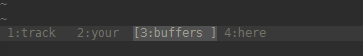
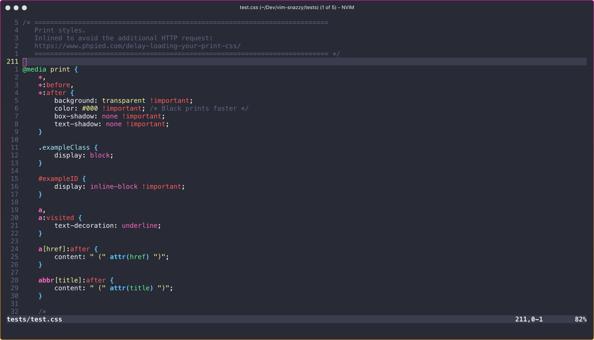
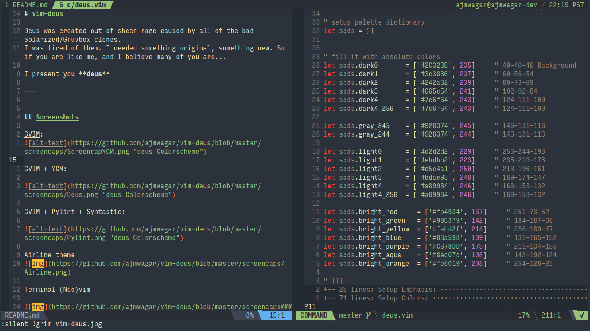
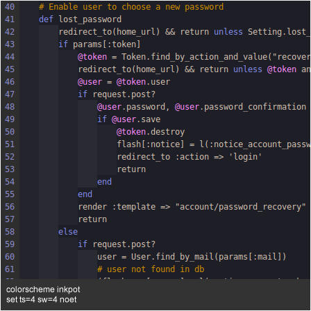
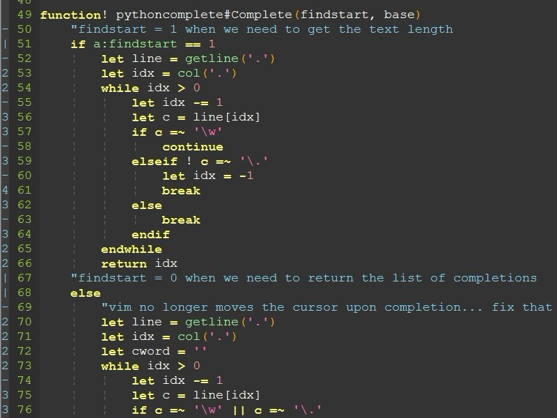
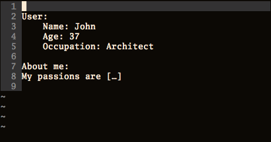

## `Neovim`插件介绍及配置

### 1. Pretty Dress 悦人的外观

#### 1.1 **Stauts Lines**

#### [`vim-airline`](https://github.com/vim-airline/vim-airline)

状态栏美化插件，需要[`powerline font`](https://github.com/powerline/fonts)

>+ **`Install:`**
>```bash
>Plugin 'vim-airline/vim-airline'
>```
>
>- **`Settings:`**
>```bash
>let g:airline_powerline_fonts = 1
>let laststatus = 2 " 总是显示状态栏
>```
>
>* **`Examples:`**
>```bash
>
>```

#### [vim-airline/vim-airline-themes](https://github.com/vim-airline/vim-airline-themes)

`airline`主题插件，一般与`vim-airline`合用

>+ **`Install:`**
>```bash
>Plug 'vim-airline/vim-airline-themes'
>```
>
>+ **`Settings:`**
>```bash
>let g:airline_theme = 'molokai'
>" 开启tabline
>let g:airline#extensions#tabline#enabled = 1      "tabline中当前buffer两端的分隔字符
>let g:airline#extensions#tabline#left_sep = ' '   "tabline中未激活buffer两端的分隔字符
>let g:airline#extensions#tabline#left_alt_sep = '|'      "tabline中buffer显示编号
>let g:airline#extensions#tabline#buffer_nr_show = 1
>" 映射切换buffer的键位
>nnoremap [b :bp<CR>
>nnoremap ]b :bn<CR>
>" 设置字体
>set guifont=Powerline_Consolas:h14:cANSI
>```
>
>+ **`Examples:`**
>查看官网`[Wiki链接](https://github.com/vim-airline/vim-airline/wiki/Screenshots)`
>


#### [bling/vim-bufferline](https://github.com/bling/vim-bufferline)

可在命令栏中显示缓冲区列表的插件，可以让你在打开的多个文件缓存间切换

+ **`Install:`**
```bash
Plug 'bling/vim-bufferline'
```

+ **`Settings:`**
```bash
<++>
```

+ **`Examples:`**


```bash
<++>
```


Plug 'liuchengxu/eleline.vim'
#### [<++>](<++>)

<++>

+ **`Install:`**
```bash
<++>
```

+ **`Settings:`**
```bash
<++>
```

+ **`Examples:`**
[插件作者写的说明](https://blog.csdn.net/simple_the_best/article/details/53906553)

```bash
<++>
```


#### 1.2 **Themes**

#### [connorholyday/vim-snazzy](https://github.com/connorholyday/vim-snazzy)

`vim`主题，下方有预览图

>+ **`Install:`**
>```bash
>Plug 'connorholyday/vim-snazzy'
>```
>
>+ **`Settings:`**
>```bash
>colors snazzy
>let g:SnazzyTransparent = 1 " 设置可透明
>```
>
>+ **`Examples:`**
>
>

#### [ajmwagar/vim-deus](https://github.com/ajmwagar/vim-deus)

`vim`主题，下方有预览图

>+ **`Install:`**
>```bash
>Plug 'ajmwagar/vim-deus'
>```
>
>+ **`Settings:`**
>```bash
>colors deus
>```
>
>+ **`Examples:`**
>
>


### 2. Genreal Highlighter
Plug 'jaxbot/semantic-highlight.vim'
Plug 'chrisbra/Colorizer' " Show colors with :ColorHighlight

#### [`vim-illuminate`](https://github.com/RRethy/vim-illuminate)
高亮当前光标下所选中字符串的其他用途
>
>`Install`
>```
>Plug 'RRethy/vim-illuminate'
>```
>`Setting`
>```
>" 延迟显示时间
>let g:Illuminate_delay = 750
>hi illuminatedWord cterm=undercurl gui=undercurl
>```
>

#### [nathanaelkane/vim-indent-guides](http://www.github.com/nathanaelkane/vim-indent-guides)

<++>
>
>+ **`Install:`**
>```
>Plug 'nathanaelkane/vim-indent-guides'
>```
>
>+ **`Settings:`**
>```
>l:indent_guides_guide_size = 1
>let g:indent_guides_start_level = 2
>```
>
>+ **`Examples:`**
>
>

#### [Yggdroot/indentLine](https://github.com/Yggdroot/indentLine)

该插件用于在每个缩进级别显示带有空格缩进的代码的垂直细线。

>+ **`Install:`**
>```
>Plug 'Yggdroot/indentLine'
>```
>
>+ **`Settings:`**
>```
>let g:indentLine_char_list = ['|', '¦', '┆', '┊']
>```
>
>+ **`Examples:`**
>


### 3. File navigation
"Plug 'scrooloose/nerdtree', { 'on': 'NERDTreeToggle' }
"Plug 'xuyuanp/nerdtree-git-plugin'
Plug 'junegunn/fzf.vim'
Plug 'francoiscabrol/ranger.vim'

[kevinhwang91/rnvimr](https://github.com/kevinhwang91/rnvimr)

>打开文件管理器`Ranger`
>
>**`Install:`**
>```
>Plug 'kevinhwang91/rnvimr', {'do': 'make sync'}
>```
>
>**`Settings:`**
>```
>" 代替内置的`Netrw` ，为文件管理器插件
>let g:rnvimr_ex_enable = 1
>" 选择文档后隐藏`ranger` 插件
>let g:rnvimr_pick_enable = 1
>" 设置`ranger`插件状态时的快捷键方式(以下快捷键是默认方式):
>" 按`Ctrl+t`从新的`tab`中打开文档
>" 按`Ctrl+x`，上下方式打开文档
>" 按`Ctrl+v`，左右方式打开文档
>let g:rnvimr_split_action = { '<C-t>': 'tab split', '<C-x>': 'split', '<C-v>': 'vsplit' }
>" 按`R`键打开`ranger`插件，并以下方`preset`中的第5个布局方式打开（第1个从0开始）
>nnoremap <silent> R :RnvimrSync<CR>:RnvimrToggle<CR><C-\><C-n>:RnvimrResize 4<CR>
>" 按`Ctrl+i`依次更换下方`preset`中的布局
>tnoremap <silent> <M-i> <C-\><C-n>:RnvimrResize<CR>
>" 设置初始布局
>let g:rnvimr_layout = { 'relative': 'editor',
>            \ 'width': float2nr(round(0.5 * &columns)),
>            \ 'height': float2nr(round(0.5 * &lines)),
>            \ 'col': float2nr(round(0.25 * &columns)),
>            \ 'row': float2nr(round(0.25 * &lines)),
>            \ 'style': 'minimal' }
>" 设置多种布局
>" 其中'{}' 表示上面设置的初始布局
>let g:rnvimr_presets = [
>            \ {'width': 0.250, 'height': 0.250},
>            \ {'width': 0.333, 'height': 0.333},
>            \ {},
>            \ {'width': 0.666, 'height': 0.666},
>            \ {'width': 0.750, 'height': 0.750},
>            \ {'width': 0.900, 'height': 0.900},
>            \ {'width': 1.000, 'height': 1.000},
>            \ {'width': 0.500, 'height': 0.500, 'col': 0, 'row': 0},
>            \ {'width': 0.500, 'height': 0.500, 'col': 0, 'row': 0.5},
>            \ {'width': 0.500, 'height': 0.500, 'col': 0.5, 'row': 0},
>            \ {'width': 0.500, 'height': 0.500, 'col': 0.5, 'row': 0.5},
>            \ {'width': 0.500, 'height': 1.000, 'col': 0, 'row': 0},
>            \ {'width': 0.500, 'height': 1.000, 'col': 0.5, 'row': 0},
>            \ {'width': 1.000, 'height': 0.500, 'col': 0, 'row': 0},
>            \ {'width': 1.000, 'height': 0.500, 'col': 0, 'row': 0.5}]
>```
>
>**`Examples:`**
>


### 4. Taglist
Plug 'liuchengxu/vista.vim'
"Plug 'majutsushi/tagbar', { 'on': 'TagbarOpenAutoClose' }

### 5. Debugger
Plug 'puremourning/vimspector', {'do': './install_gadget.py --enable-c --enable-python'}

### 6. REPL
Plug 'rhysd/reply.vim'

### 7. Error checking, handled by coc
"Plug 'w0rp/ale'

### 8. Auto Complete
Plug 'neoclide/coc.nvim', {'branch': 'release'}

### 9. Snippits
Plug 'SirVer/ultisnips'
Plug 'honza/vim-snippets'

### 10. Undo Tree
Plug 'mbbill/undotree'

### 11. Git
Plug 'theniceboy/vim-gitignore', { 'for': ['gitignore', 'vim-plug'] }
Plug 'fszymanski/fzf-gitignore', { 'do': ':UpdateRemotePlugins' }
"Plug 'mhinz/vim-signify'
Plug 'airblade/vim-gitgutter'

### 12. Tex
"Plug 'lervag/vimtex'

### 13. CSharp
Plug 'OmniSharp/omnisharp-vim'
Plug 'ctrlpvim/ctrlp.vim' , { 'for': ['cs', 'vim-plug'] } " omnisharp-vim dependency

### 14. Other code language like HTML, CSS, JavaScript, PHP, JSON, etc.
Plug 'elzr/vim-json'
Plug 'hail2u/vim-css3-syntax', { 'for': ['vim-plug', 'php', 'html', 'javascript', 'css', 'less'] }
Plug 'spf13/PIV', { 'for' :['php', 'vim-plug'] }
Plug 'pangloss/vim-javascript', { 'for': ['vim-plug', 'php', 'html', 'javascript', 'css', 'less'] }
Plug 'yuezk/vim-js', { 'for': ['vim-plug', 'php', 'html', 'javascript', 'css', 'less'] }
Plug 'MaxMEllon/vim-jsx-pretty', { 'for': ['vim-plug', 'php', 'html', 'javascript', 'css', 'less'] }
Plug 'jelera/vim-javascript-syntax', { 'for': ['vim-plug', 'php', 'html', 'javascript', 'css', 'less'] }
"Plug 'jaxbot/browserlink.vim'

### 15. Go
Plug 'fatih/vim-go' , { 'for': ['go', 'vim-plug'], 'tag': '*' }

### 16. Python
Plug 'tmhedberg/SimpylFold', { 'for' :['python', 'vim-plug'] }
Plug 'Vimjas/vim-python-pep8-indent', { 'for' :['python', 'vim-plug'] }
Plug 'numirias/semshi', { 'do': ':UpdateRemotePlugins', 'for' :['python', 'vim-plug'] }
"Plug 'vim-scripts/indentpython.vim', { 'for' :['python', 'vim-plug'] }
"Plug 'plytophogy/vim-virtualenv', { 'for' :['python', 'vim-plug'] }
Plug 'tweekmonster/braceless.vim'

### 17. Markdown
---
#### 先了解[markdown文档格式](https://github.com/adam-p/markdown-here/wiki/Markdown-Here-Cheatsheet)
---

#### [markdown-preview.nvim](https://github.com/iamcco/markdown-preview.vim) 

通过浏览器实时预览`markdown`文件

>
>`Install:`
>```
>Plug 'iamcco/markdown-preview.nvim', { 'do': { -> mkdp#util#install_sync() }, 'for' :['markdown', 'vim-plug'] }
>```
>
>`Settings`
>```
>let g:mkdp_auto_start = 0
>let g:mkdp_auto_close = 1
>let g:mkdp_refresh_slow = 0
>let g:mkdp_command_for_global = 0
>let g:mkdp_open_to_the_world = 0
>let g:mkdp_open_ip = ''
>let g:mkdp_browser = 'chromium'
>let g:mkdp_echo_preview_url = 0
>let g:mkdp_browserfunc = ''
>let g:mkdp_preview_options = {
>    \ 'mkit': {},
>    \ 'katex': {},
>    \ 'uml': {},
>    \ 'maid': {},
>    \ 'disable_sync_scroll': 0,
>    \ 'sync_scroll_type': 'middle',
>    \ 'hide_yaml_meta': 1
>    \ }
>let g:mkdp_markdown_css = ''
>let g:mkdp_highlight_css = ''
>let g:mkdp_port = ''
>let g:mkdp_page_title = '「${name}」'
>```
>
>配置说明
>```bash
>let g:mkdp_path_to_chrome = "firefox"
>" 设置 chrome 浏览器的路径（或是启动 chrome（或其他现代浏览器）的命令）
>" 如果设置了该参数, g:mkdp_browserfunc 将被忽略
>
>let g:mkdp_browserfunc = 'MKDP_browserfunc_default'
>" vim 回调函数, 参数为要打开的 url
>
>let g:mkdp_auto_start = 1
>" 设置为 1 可以在打开 markdown 文件的时候自动打开浏览器预览，只在打开
>" markdown 文件的时候打开一次
>
>let g:mkdp_auto_open = 1
>" 设置为 1 在编辑 markdown 的时候检查预览窗口是否已经打开，否则自动打开预
>" 览窗口
>
>let g:mkdp_auto_close = 1
>" 在切换 buffer 的时候自动关闭预览窗口，设置为 0 则在切换 buffer 的时候不
>" 自动关闭预览窗口
>
>let g:mkdp_refresh_slow = 0
>" 设置为 1 则只有在保存文件，或退出插入模式的时候更新预览，默认为 0，实时
>" 更新预览
>
>let g:mkdp_command_for_global = 0
>" 设置为 1 则所有文件都可以使用 MarkdownPreview 进行预览，默认只有 markdown
>" 文件可以使用改命令
>
>let g:mkdp_open_to_the_world = 0
>" 设置为 1, 在使用的网络中的其他计算机也能访问预览页面
>" 默认只监听本地（127.0.0.1），其他计算机不能访问
>```
>`Examples`
>
>```
>None
>```


#### [vim-table-mode](https://github.com/dhruvasagar/vim-table-mode ) 
制表模式

>**`Install:`**
>```
>Plug 'dhruvasagar/vim-table-mode', { 'on': 'TableModeToggle' }
>```
>
>`Settings`
>```
>map <LEADER>tm :TableModeToggle<CR>
>```
>
>**引用其他文件来映射键位**
>
>```bash
>source ~/.vim/md-snippits.vim
>```
>
>`md-snippits.vim` 里面的内容如下：
>
>```
>"autocmd Filetype markdown map <leader>w yiWi[<esc>Ea](<esc>pa)
>autocmd Filetype markdown inoremap ,f <Esc>/<++><CR>:nohlsearch<CR>c4l
>autocmd Filetype markdown inoremap ,n ---<Enter><Enter>
>autocmd Filetype markdown inoremap ,b **** <++><Esc>F*hi
>autocmd Filetype markdown inoremap ,s ~~~~ <++><Esc>F~hi
>autocmd Filetype markdown inoremap ,i ** <++><Esc>F*i
>autocmd Filetype markdown inoremap ,d `` <++><Esc>F`i
>autocmd Filetype markdown inoremap ,c ```<Enter><++><Enter>```<Enter><Enter><++><Esc>4kA
>autocmd Filetype markdown inoremap ,h ====<Space><++><Esc>F=hi
>autocmd Filetype markdown inoremap ,p  <++><Esc>F[a
>autocmd Filetype markdown inoremap ,a [](<++>) <++><Esc>F[a
>autocmd Filetype markdown inoremap ,1 #<Space><Enter><++><Esc>kA
>autocmd Filetype markdown inoremap ,2 ##<Space><Enter><++><Esc>kA
>autocmd Filetype markdown inoremap ,3 ###<Space><Enter><++><Esc>kA
>autocmd Filetype markdown inoremap ,4 ####<Space><Enter><++><Esc>kA
>autocmd Filetype markdown inoremap ,l --------<Enter>
>```
>`Examples`
>| 快捷键 | 呈现效果       |
>|--------|----------------|
>| `,n`   | ---            |
>| `,b`   | 文本 **加粗**  |
>| `,s`   | 文本~~中划线~~ |
>| `,i`   | 文本 *斜体*    |
>| `,d`   | `代码块`       |
>| `,c`   | 大 `代码块`    |
>| `,m`   | - [ ] 复选框   |
>| `,p`   | 图片           |
>| `,a`   | [超链接]()     |
>| `,1`   | # 标题1        |
>| `,2`   | ## 标题2       |
>| `,3`   | ### 标题3      |
>| `,4`   | #### 标题4     |
>| `,l`   | --------       |
>
>`,r` 跳转至下一个 `<++>` (占位符)，并复制
>
>`,e` 跳转到至下一个 `<++>` (占位符)
>
>`,w` 跳转至下一个 `<++>` (占位符) 然后帮你键入`Enter`


#### [vimwiki/vimwiki](https://github.com/vimwiki/vimwiki) 

文档管理插件


#### [iamcco/mathjax-support-for-mkdp]()

预览数学公式

#### [mzlogin/vim-markdown-toc](<++>)


`Install:`
```
Plug 'mzlogin/vim-markdown-toc', { 'for': ['gitignore', 'markdown'] }
```

`Settings`
```
<++>
```


### 18. Other filetypes
Plug 'jceb/vim-orgmode', {'for': ['vim-plug', 'org']}

### 19. Editor Enhancement
"Plug 'Raimondi/delimitMate'
Plug 'jiangmiao/auto-pairs'
Plug 'terryma/vim-multiple-cursors'
Plug 'mg979/vim-visual-multi'
Plug 'scrooloose/nerdcommenter' " in <space>cn to comment a line
Plug 'AndrewRadev/switch.vim' " gs to switch

#### [`vim-surround`](https://github.com/tpope/vim-surround)
快捷添加或者替换成对符号

>`Install:`
>```
>Plug 'tpope/vim-surround' 
>```
>`Settings:`
>```
>vnoremap " S"
>vnoremap ' S'
>vnoremap ` S`
>vnoremap [ S[
>vnoremap ( S(
>vnoremap { S{
>vnoremap } S}
>vnoremap ] S]
>vnoremap ) S)
>```
>
>`Examples:`
>
>添加成对符号(`string` -> `"string"`):
>```
>string
>```
>按`yshw"`
>```
>"string"
>```
>
>修改成对符号(`"string"` -> `'string'`)，按`cs"'`
>```
>'string'
>```
> 


Plug 'gcmt/wildfire.vim' " in Visual mode, type k' to select all text in '', or type k) k] k} kp
Plug 'junegunn/vim-after-object' " da= to delete what's after =
Plug 'junegunn/vim-easy-align' " gaip= to align the = in paragraph, 
Plug 'tpope/vim-capslock'	" Ctrl+L (insert) to toggle capslock
Plug 'easymotion/vim-easymotion'
Plug 'Konfekt/FastFold'
Plug 'junegunn/vim-peekaboo'
Plug 'bkad/CamelCaseMotion'
"Plug 'wellle/context.vim'
Plug 'svermeulen/vim-subversive'

### 20. Input Method Autoswitch
"Plug 'rlue/vim-barbaric' " slowing down vim-multiple-cursors

### 21. Formatter
Plug 'Chiel92/vim-autoformat'

### 22. For general writing
Plug 'junegunn/goyo.vim'
"Plug 'reedes/vim-wordy'
"Plug 'ron89/thesaurus_query.vim'

### 23. Bookmarks
"Plug 'kshenoy/vim-signature'
Plug 'MattesGroeger/vim-bookmarks'

### 24. Find & Replace
Plug 'brooth/far.vim', { 'on': ['F', 'Far', 'Fardo'] }
Plug 'osyo-manga/vim-anzu'

### 25. Documentation
"Plug 'KabbAmine/zeavim.vim' " <LEADER>z to find doc

### 26. Mini Vim-APP
"Plug 'voldikss/vim-floaterm'
"Plug 'liuchengxu/vim-clap'
"Plug 'jceb/vim-orgmode'
Plug 'mhinz/vim-startify'

### 27. Vim Applications
Plug 'itchyny/calendar.vim'

### 28. Other visual enhancement
Plug 'ryanoasis/vim-devicons'
Plug 'luochen1990/rainbow'
" Plug 'mg979/vim-xtabline'
Plug 'wincent/terminus'

### 29. Other useful utilities
Plug 'lambdalisue/suda.vim' " do stuff like :SudoWrite
Plug 'makerj/vim-pdf'
"Plug 'xolox/vim-session'
"Plug 'xolox/vim-misc' " vim-session dep
Plug 'semanser/vim-outdated-plugins'

### 30. Dependencies
Plug 'MarcWeber/vim-addon-mw-utils'
Plug 'kana/vim-textobj-user'
Plug 'roxma/nvim-yarp'
Plug 'rbgrouleff/bclose.vim' " For ranger.vim


" ===================== Start of Plugin Settings =====================
" ===
" === NERDTree
" ===
"map tt :NERDTreeToggle<CR>
"let NERDTreeMapOpenExpl = ""
"let NERDTreeMapUpdir = "J"
"let NERDTreeMapUpdirKeepOpen = "j"
"let NERDTreeMapOpenSplit = ""
"let NERDTreeOpenVSplit = "L"
"let NERDTreeMapActivateNode = "l"
"let NERDTreeMapOpenInTab = "o"
"let NERDTreeMapOpenInTabSilent = "O"
"let NERDTreeMapPreview = ""
"let NERDTreeMapCloseDir = ""
"let NERDTreeMapChangeRoot = "u"
"let NERDTreeShowLineNumber = 1
"let NERDTreeAutoCenter= 1
"let NERDTreeShowHidden = 1
"let NERDTreeMapMenu = ","
"let NERDTreeMapToggleHidden = "zh"
"let NERDTreeIgnore = ['\.pyc','\~$','\.swp']
""设置树的显示图标
"let g:NERDTreeDirArrowExpandable = '▸'
"let g:NERDTreeDirArrowCollapsible = '▾'


" ===
" === eleline.vim
" ===
let g:airline_powerline_fonts = 0


" ==
" == GitGutter
" ==
let g:gitgutter_signs = 0
let g:gitgutter_map_keys = 0
let g:gitgutter_override_sign_column_highlight = 0
let g:gitgutter_preview_win_floating = 1
autocmd BufWritePost * GitGutter
nnoremap <LEADER>gf :GitGutterFold<CR>
nnoremap U :GitGutterPreviewHunk<CR>
nnoremap <LEADER>g- :GitGutterPrevHunk<CR>
nnoremap <LEADER>g= :GitGutterNextHunk<CR>


" ===
" === coc
" ===
" fix the most annoying bug that coc has
silent! au BufEnter,BufRead,BufNewFile * silent! unmap if
let g:coc_global_extensions = ['coc-python', 'coc-vimlsp', 'coc-html', 'coc-json', 'coc-css', 'coc-tsserver', 'coc-yank', 'coc-lists', 'coc-gitignore', 'coc-vimlsp', 'coc-tailwindcss', 'coc-stylelint', 'coc-tslint', 'coc-lists', 'coc-git', 'coc-explorer', 'coc-pyright', 'coc-sourcekit', 'coc-translator']
"set statusline^=%{coc#status()}%{get(b:,'coc_current_function','')}
" use <tab> for trigger completion and navigate to the next complete item
function! s:check_back_space() abort
	let col = col('.') - 1
	return !col || getline('.')[col - 1]	=~ '\s'
endfunction
inoremap <silent><expr> <Tab>
			\ pumvisible() ? "\<C-n>" :
			\ <SID>check_back_space() ? "\<Tab>" :
			\ coc#refresh()
inoremap <expr> <S-Tab> pumvisible() ? "\<C-p>" : "\<S-Tab>"
"inoremap <silent><expr> <CR> pumvisible() ? "\<C-y><CR>" : "\<CR>"
function! s:check_back_space() abort
	let col = col('.') - 1
	return !col || getline('.')[col - 1]  =~# '\s'
endfunction
inoremap <silent><expr> <c-space> coc#refresh()
" Useful commands
nnoremap <silent> <space>y :<C-u>CocList -A --normal yank<cr>
nmap <silent> gd <Plug>(coc-definition)
nmap <silent> gy <Plug>(coc-type-definition)
nmap <silent> gi <Plug>(coc-implementation)
nmap <silent> gr <Plug>(coc-references)
nmap <leader>rn <Plug>(coc-rename)
nmap tt :CocCommand explorer<CR>
" coc-todolist
noremap ta :CocCommand todolist.create<CR>
noremap td :CocCommand todolist.upload<CR>
noremap tD :CocCommand todolist.download<CR>
noremap tc :CocCommand todolist.clearNotice<CR>
"noremap tl :CocList --normal todolist<CR>
" coc-translator
nmap ts <Plug>(coc-translator-p)
" coc-markmap
command! Markmap CocCommand markmap.create


" ===
" === MarkdownPreview
" ===
let g:mkdp_auto_start = 0
let g:mkdp_auto_close = 1
let g:mkdp_refresh_slow = 0
let g:mkdp_command_for_global = 0
let g:mkdp_open_to_the_world = 0
let g:mkdp_open_ip = ''
let g:mkdp_echo_preview_url = 0
let g:mkdp_browserfunc = ''
let g:mkdp_preview_options = {
	\ 'mkit': {},
	\ 'katex': {},
	\ 'uml': {},
	\ 'maid': {},
	\ 'disable_sync_scroll': 0,
	\ 'sync_scroll_type': 'middle',
	\ 'hide_yaml_meta': 1
	\ }
let g:mkdp_markdown_css = ''
let g:mkdp_highlight_css = ''
let g:mkdp_port = ''
let g:mkdp_page_title = '「${name}」'

" ===
" === Python-syntax
" ===
let g:python_highlight_all = 1
" let g:python_slow_sync = 0

" ===
" === vim-table-mode
" ===
map <LEADER>tm :TableModeToggle<CR>
let g:table_mode_cell_text_object_i_map = 'k<Bar>'

" ===
" === FZF
" ===
"set rtp+=/usr/local/opt/fzf
"set rtp+=/home/linuxbrew/.linuxbrew/opt/fzf
noremap <C-p> :FZF<CR>
noremap <C-f> :Ag<CR>
noremap <C-h> :MRU<CR>
noremap <C-t> :BTags<CR>
noremap <C-l> :LinesWithPreview<CR>
noremap <C-w> :Buffers<CR>
"noremap ; :History:<CR>

autocmd! FileType fzf
autocmd  FileType fzf set laststatus=0 noruler
  \| autocmd BufLeave <buffer> set laststatus=2 ruler

command! -bang -nargs=* Buffers
  \ call fzf#vim#buffers(
  \   '',
  \   <bang>0 ? fzf#vim#with_preview('up:60%')
  \		   : fzf#vim#with_preview('right:0%', '?'),
  \   <bang>0)


command! -bang -nargs=* LinesWithPreview
	\ call fzf#vim#grep(
	\   'rg --with-filename --column --line-number --no-heading --color=always --smart-case . '.fnameescape(expand('%')), 1,
	\   fzf#vim#with_preview({}, 'up:50%', '?'),
	\   1)

command! -bang -nargs=* Ag
  \ call fzf#vim#ag(
  \   '',
  \   <bang>0 ? fzf#vim#with_preview('up:60%')
  \		   : fzf#vim#with_preview('right:50%', '?'),
  \   <bang>0)


command! -bang -nargs=* MRU call fzf#vim#history(fzf#vim#with_preview())

command! -bang BTags
  \ call fzf#vim#buffer_tags('', {
  \	 'down': '40%',
  \	 'options': '--with-nth 1 
  \				 --reverse 
  \				 --prompt "> " 
  \				 --preview-window="70%" 
  \				 --preview "
  \					 tail -n +\$(echo {3} | tr -d \";\\\"\") {2} |
  \					 head -n 16"'
  \ })


" ===
" === CTRLP (Dependency for omnisharp)
" ===
let g:ctrlp_map = ''
let g:ctrlp_cmd = 'CtrlP'


" ===
" === vim-bookmarks
" ===
let g:bookmark_no_default_key_mappings = 1
nmap mt <Plug>BookmarkToggle
nmap ma <Plug>BookmarkAnnotate
nmap ml <Plug>BookmarkShowAll
nmap mi <Plug>BookmarkNext
nmap mn <Plug>BookmarkPrev
nmap mC <Plug>BookmarkClear
nmap mX <Plug>BookmarkClearAll
nmap mu <Plug>BookmarkMoveUp
nmap me <Plug>BookmarkMoveDown
nmap <Leader>g <Plug>BookmarkMoveToLine
let g:bookmark_save_per_working_dir = 1
let g:bookmark_auto_save = 1
let g:bookmark_highlight_lines = 1
let g:bookmark_manage_per_buffer = 1
let g:bookmark_save_per_working_dir = 1
let g:bookmark_center = 1
let g:bookmark_auto_close = 1
let g:bookmark_location_list = 1


" ===
" === Undotree
" ===
noremap O :UndotreeToggle<CR>
let g:undotree_DiffAutoOpen = 1
let g:undotree_SetFocusWhenToggle = 1
let g:undotree_ShortIndicators = 1
let g:undotree_WindowLayout = 2
let g:undotree_DiffpanelHeight = 8
let g:undotree_SplitWidth = 24
function g:Undotree_CustomMap()
	nmap <buffer> i <plug>UndotreeNextState
	nmap <buffer> k <plug>UndotreePreviousState
	nmap <buffer> I 5<plug>UndotreeNextState
	nmap <buffer> K 5<plug>UndotreePreviousState
endfunc


" ==
" == vim-multiple-cursor
" ==
let g:multi_cursor_use_default_mapping = 0
let g:multi_cursor_start_word_key = '<c-k>'
let g:multi_cursor_select_all_word_key = '<a-k>'
let g:multi_cursor_start_key = 'g<c-k>'
let g:multi_cursor_select_all_key = 'g<a-k>'
let g:multi_cursor_next_key = '<c-k>'
let g:multi_cursor_prev_key = '<c-p>'
let g:multi_cursor_skip_key = '<C-s>'
let g:multi_cursor_quit_key = '<Esc>'


" ===
" === Far.vim
" ===
noremap <LEADER>f :F  %<left><left>


" ===
" === Bullets.vim
" ===
"let g:bullets_set_mappings = 0
let g:bullets_enabled_file_types = [
			\ 'markdown',
			\ 'text',
			\ 'gitcommit',
			\ 'scratch'
			\]


" ===
" === Vista.vim
" ===
noremap <silent> T :Vista!!<CR>
let g:vista_icon_indent = ["╰─▸ ", "├─▸ "]
let g:vista_default_executive = 'ctags'
let g:vista_fzf_preview = ['right:50%']
let g:vista#renderer#enable_icon = 1
let g:vista#renderer#icons = {
\   "function": "\uf794",
\   "variable": "\uf71b",
\  }
function! NearestMethodOrFunction() abort
	return get(b:, 'vista_nearest_method_or_function', '')
endfunction
set statusline+=%{NearestMethodOrFunction()}
autocmd VimEnter * call vista#RunForNearestMethodOrFunction()


" ===
" === Ranger.vim
" ===
nnoremap R :Ranger<CR>
let g:ranger_map_keys = 0


" ===
" === fzf-gitignore
" ===
noremap <LEADER>gi :FzfGitignore<CR>


" ===
" === Ultisnips
" ===
let g:tex_flavor = "latex"
inoremap <c-n> <nop>
let g:UltiSnipsExpandTrigger="<c-e>"
let g:UltiSnipsJumpForwardTrigger="<c-e>"
let g:UltiSnipsJumpBackwardTrigger="<c-n>"
let g:UltiSnipsSnippetDirectories = [$HOME.'/.config/nvim/Ultisnips/', 'UltiSnips']
silent! au BufEnter,BufRead,BufNewFile * silent! unmap <c-r>


" ===
" === vimtex
" ===
""let g:vimtex_view_method = ''
"let g:vimtex_view_general_viewer = 'llpp'
"let g:vimtex_mappings_enabled = 0
"let g:vimtex_text_obj_enabled = 0
"let g:vimtex_motion_enabled = 0
"let maplocalleader=' '


" ===
" === Anzu
" ===
set statusline=%{anzu#search_status()}
nnoremap = n
nnoremap - N


" ===
" === vim-go
" ===
let g:go_def_mapping_enabled = 0
let g:go_template_autocreate = 0
let g:go_textobj_enabled = 0
let g:go_auto_type_info = 1
let g:go_def_mapping_enabled = 0
let g:go_highlight_array_whitespace_error = 1
let g:go_highlight_build_constraints = 1
let g:go_highlight_chan_whitespace_error = 1
let g:go_highlight_extra_types = 1
let g:go_highlight_fields = 1
let g:go_highlight_format_strings = 1
let g:go_highlight_function_calls = 1
let g:go_highlight_function_parameters = 1
let g:go_highlight_functions = 1
let g:go_highlight_generate_tags = 1
let g:go_highlight_methods = 1
let g:go_highlight_operators = 1
let g:go_highlight_space_tab_error = 1
let g:go_highlight_string_spellcheck = 1
let g:go_highlight_structs = 1
let g:go_highlight_trailing_whitespace_error = 1
let g:go_highlight_types = 1
let g:go_highlight_variable_assignments = 0
let g:go_highlight_variable_declarations = 0


" ===
" === AutoFormat
" ===
nnoremap \f :Autoformat<CR>


" ===
" === OmniSharp
" ===
let g:OmniSharp_typeLookupInPreview = 1
let g:omnicomplete_fetch_full_documentation = 1

let g:OmniSharp_server_use_mono = 1
let g:OmniSharp_server_stdio = 1
let g:OmniSharp_highlight_types = 2
let g:OmniSharp_selector_ui = 'ctrlp'

autocmd Filetype cs nnoremap <buffer> gd :OmniSharpPreviewDefinition<CR>
autocmd Filetype cs nnoremap <buffer> gr :OmniSharpFindUsages<CR>
autocmd Filetype cs nnoremap <buffer> gy :OmniSharpTypeLookup<CR>
autocmd Filetype cs nnoremap <buffer> ga :OmniSharpGetCodeActions<CR>
autocmd Filetype cs nnoremap <buffer> <LEADER>rn :OmniSharpRename<CR><C-N>:res +5<CR>

sign define OmniSharpCodeActions text=💡

augroup OSCountCodeActions
	autocmd!
	autocmd FileType cs set signcolumn=yes
	autocmd CursorHold *.cs call OSCountCodeActions()
augroup END

function! OSCountCodeActions() abort
	if bufname('%') ==# '' || OmniSharp#FugitiveCheck() | return | endif
	if !OmniSharp#IsServerRunning() | return | endif
	let opts = {
				\ 'CallbackCount': function('s:CBReturnCount'),
				\ 'CallbackCleanup': {-> execute('sign unplace 99')}
				\}
	call OmniSharp#CountCodeActions(opts)
endfunction

function! s:CBReturnCount(count) abort
	if a:count
		let l = getpos('.')[1]
		let f = expand('%:p')
		execute ':sign place 99 line='.l.' name=OmniSharpCodeActions file='.f
	endif
endfunction


" ===
" === Colorizer
" ===
let g:colorizer_syntax = 1


" ===
" === vim-floaterm
" ===
"nnoremap ? :FloatermToggle<CR>
"let g:floaterm_position = 'center'
"let g:floaterm_winblend = 20
"let g:floaterm_height = winheight(0)/3*2
"let g:floaterm_width = &columns/3*2


" ===
" === vim-easymotion
" ===
let g:EasyMotion_do_mapping = 0
let g:EasyMotion_do_shade = 0
let g:EasyMotion_smartcase = 1
map ' <Plug>(easymotion-bd-f)
nmap ' <Plug>(easymotion-bd-f)
"map E <Plug>(easymotion-j)
"map U <Plug>(easymotion-k)
"nmap f <Plug>(easymotion-overwin-f)
"map \; <Plug>(easymotion-prefix)
"nmap ' <Plug>(easymotion-overwin-f2)
"map 'l <Plug>(easymotion-bd-jk)
"nmap 'l <Plug>(easymotion-overwin-line)
"map  'w <Plug>(easymotion-bd-w)
"nmap 'w <Plug>(easymotion-overwin-w)


" ===
" === goyo
" ===
map <LEADER>gy :Goyo<CR>


" ===
" === jsx
" ===
let g:vim_jsx_pretty_colorful_config = 1


" ===
" === fastfold
" ===
nmap zuz <Plug>(FastFoldUpdate)
let g:fastfold_savehook = 1
let g:fastfold_fold_command_suffixes =  ['x','X','a','A','o','O','c','C']
let g:fastfold_fold_movement_commands = [']z', '[z', 'ze', 'zu']
let g:markdown_folding = 1
let g:tex_fold_enabled = 1
let g:vimsyn_folding = 'af'
let g:xml_syntax_folding = 1
let g:javaScript_fold = 1
let g:sh_fold_enabled= 7
let g:ruby_fold = 1
let g:perl_fold = 1
let g:perl_fold_blocks = 1
let g:r_syntax_folding = 1
let g:rust_fold = 1
let g:php_folding = 1


" ===
" === vim-easy-align
" ===
xmap ga <Plug>(EasyAlign)
nmap ga <Plug>(EasyAlign)


" ===
" === vim-after-object
" ===
autocmd VimEnter * call after_object#enable('=', ':', '-', '#', ' ')


" ===
" === vim-map-leader
" ===
let g:leaderMenu = {'name':  "Shortcut Menu",
\'SPC f':  ['Advanced find'],
\'SPC rc': ['Edit nvim config'],
\'SPC Enter':  ['Clear search'],
\'SPC dw':  ['Remove adj. dup. words'],
\'SPC tt':  ['spc to tabs'],
\'SPC o':  ['Open folds'],
\'SPC q':  ['Close win below'],
\'SPC /':  ['Open terminal'],
\'SPC <SPC>':  ['Find <++>'],
\'SPC sc':  ['Toggle spell-check'],
\'SPC gf':  ['Fold unchanged'],
\'SPC g-':  ['Previous hunk'],
\'SPC g=':  ['Next Hunk'],
\'SPC rn':  ['Rename variable'],
\'SPC tm':  ['Toggle table-mode'],
\'SPC a':  ['Calculate equation'],
\'SPC gi':  ['New .gitignore'],
\'SPC gy':  ['Toggle focus mode'],
\}
nnoremap <silent> ? :call leaderMapper#start() "<Space>"<CR>
let g:leaderMapperWidth = 80


" ===
" === rainbow
" ===
let g:rainbow_active = 1


" ===
" === xtabline
" ===
"let g:xtabline_settings = {}
"let g:xtabline_settings.enable_mappings = 0
"let g:xtabline_settings.tabline_modes = ['tabs', 'buffers']
"let g:xtabline_settings.enable_persistance = 0
"let g:xtabline_settings.last_open_first = 1
"noremap to :XTabCycleMode<CR>
"noremap \p :XTabInfo<CR>


" ===
" === vim session
" ===
let g:session_directory = $HOME."/.config/nvim/tmp/sessions"
let g:session_autosave = 'no'
let g:session_autoload = 'no'
"let g:session_autosave_periodic = 1
"let g:session_autosave_silent = 1
set sessionoptions-=buffers
set sessionoptions-=options
noremap sl :OpenSession<CR>
noremap ss :SaveSession<CR>
noremap sc :CloseSession<CR>
noremap sD :DeleteSession<CR>
noremap sA :AppendTabSession<CR>


" ===
" === context.vim
" ===
let g:context_add_mappings = 0
noremap <leader>ct :ContextToggle<CR>


" ===
" === suda.vim
" ===
cnoreabbrev sudowrite w suda://%


" ===
" === vimspector
" ===
let g:vimspector_enable_mappings = 'HUMAN'
function! s:read_template_into_buffer(template)
	" has to be a function to avoid the extra space fzf#run insers otherwise
	execute '0r ~/.config/nvim/sample_vimspector_json/'.a:template
endfunction
command! -bang -nargs=* LoadVimSpectorJsonTemplate call fzf#run({
			\   'source': 'ls -1 ~/.config/nvim/sample_vimspector_json',
			\   'down': 20,
			\   'sink': function('<sid>read_template_into_buffer')
			\ })
noremap <leader>vs :tabe .vimspector.json<CR>:LoadVimSpectorJsonTemplate<CR>


" ===
" === camelcase
" ===
map <silent> w <Plug>CamelCaseMotion_w
map <silent> b <Plug>CamelCaseMotion_b
map <silent> e <Plug>CamelCaseMotion_e
map <silent> ge <Plug>CamelCaseMotion_ge
sunmap w
sunmap b
sunmap e
sunmap ge


" ===
" === reply.vim
" ===
noremap <LEADER>rp :w<CR>:Repl<CR><C-\><C-N><C-w><C-h>
noremap <LEADER>rs :ReplSend<CR><C-w><C-l>a<CR><C-\><C-N><C-w><C-h>
noremap <LEADER>rt :ReplStop<CR>


" ===================== End of Plugin Settings =====================

```
